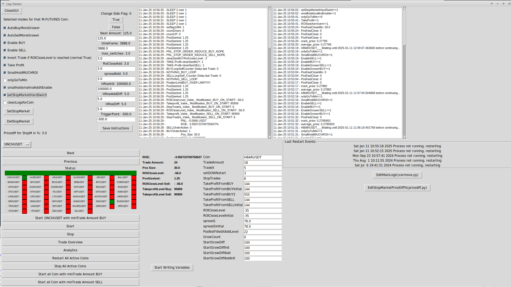

# CryptoBot AUTO  Trade - Python Binance API Trading GUI

CHECK FILE NOW.py   that is the BOT.



## WT95 Binance Bot Python API GUI Self/Parallel Multi-Coin Multi-Function Trader Tools

### IMPORTANT: GENERAL USAGE AT YOUR OWN RISK. YOU NEED TO KNOW WHAT YOU ARE DOING AND HOW TO SET IT UP!

#### If you set one variable wrong or encounter a bug because you do not know what you are doing, it is your responsibility. This is not a final version. I have used it extensively and it is stable, but some features (like PNL calculations) may need further refinement.

#### I do not take any responsibility for any loss or if a user complains about it.

I am sharing this old version as I no longer use it. It was a lot of work to create, and you can expand on it. Some traders might find it helpful. Note that it is buggy and unpolished but it runs as is. Be cautious as I might not have shared the latest stable version. Check first, but it should run as is. However, it is very raw.

You need to create all folders for coins before running it. You can find the required folders in `NOW.py`. Some elements with the Tkinter window may crash or have issues after a while.

### How to Use
You need to create the content for all coins before running it, e.g., content from `coins/BTCUSDT`. I will create a better README later.

See the .png files in the root directory to understand what it is and how it looks at the last stage.

If you start a coin in the GUI, you can close the GUI, and the started bot will still run in the background (`restarter.py` keeps all running). To stop all, you need to stop each coin specifically. You are the boss, as long as your computer and internet connection are stable (and the code is stable). If a coin is started, it will continue running until you stop it in the GUI. Pay attention! If you close the GUI without stopping it, it will continue running in the background.

Use it slowly and learn what each function does in `NOW.py` in each coin folder. You can use a coin folder name slot with another symbol, which should be manageable for you.

## Key Features
- **Bot Mode**
- **Human Mode** (with specific settings and auto stop-loss)
- **Mixed Mode**

You can run up to 10+ coins in parallel. Pay attention to API call rate limits. If you reach the rate limit, the bot can stop and you may lose all your progress.

In the future, we might replace API calls with WebSocket streams for user account data. I will add this soon, or someone else can make a PR to implement this.

### Multi-Coin Support
- Trade Binance USD-M Futures Coins. Most should work.
- Easily switch between coins with dropdown menus and a streamlined GUI.

### Manual and Automated Trading
**Manual Mode:**
- Execute trades with full control over:
  - Trade Amount
  - Price Difference
  - Order Execution Time
- Dedicated buttons for Buy, Sell, and Close Position actions.

**Automated Mode:**
- Enable advanced features like:
  - AutoBuyGrower: Automatically scales buy positions dynamically.
  - AutoSellMoreGrower: Automatically scales sell positions dynamically.
- Configurable logic for:
  - Stop-loss
  - Take-profit
  - Hard-switch market orders

### Advanced Analytics
- **PNL Graphs:**
  - Track accumulated PNL over time with annotations.
  - Apply date filters to analyze specific trading periods.
- **Combined Metrics:**
  - Overlay metrics such as ROE Close, PNL, and Position Size for in-depth insights.
  - Toggle between combined and individual views for granular analysis.
- **Log Filtering:**
  - Filter logs by date and event for efficient debugging and analysis.

### Real-Time Market Data
- Embedded TradingView-style charts for live price trends.
- Real-time order book visualization with buyer/seller breakdowns.
- Dynamic metrics for ROI Close Levels, spreads, and position sizes.

### Configurable Trading Strategies
- Supports advanced strategies using `NOW.py` as the bot routine and `varmove.py` settings for each coin.
- Customize thresholds for:
  - Take-profit
  - Stop-loss
  - Spread settings
- Edit trading logic directly via the GUI (`NOW.py`, `varmove.py`, `pricediff.py`).

### Secure API Management
- Should be safe because you run your own instance. Pay attention not to run more than 10 coins per IP.

### Robust Logging System
- **Comprehensive Logs:**
  - Records every trade, market event, and bot action.
- **Restart Events:**
  - Keep track of system health and recovery actions.

## Getting Started
### Environment Setup on Linux
- Install Python 3.8. Ensure Python 3.8 is installed on your system:
  ```sh
  sudo apt update
  sudo apt install python3.8 python3.8-venv python3.8-dev


Clone the Repository
sh

git clone https://github.com/BITRY/WT95_Binance_bot_python_api_GUI_self_or_together_multi_coin_multifunctions_trader_Tools.git
cd WT95_Binance_python_api_GUI

Create a Virtual Environment
sh

python3.8 -m venv venv
source venv/bin/activate

Install Dependencies
sh

pip install --upgrade pip
pip install -r requirements.txt

How to Run the Bot

Activate your environment:
sh

source venv/bin/activate

Run the bot:
sh

python3.8 WT_95.py

Detailed Features
GUI Options
Option	Function
AutoBuyGrower	Automatically increases the size of buy orders over time.
AutoSellMoreGrower	Automatically increases the size of sell orders over time.
EnableBUY	Enables Buy orders.
EnableSELL	Enables Sell orders.
Take Profit	Closes positions when a specific profit target is reached.
setStopMarketHardSwitch	Enables strict stop-market orders.
Invert Trade	Switches the behavior of ROI close logic (e.g., flipping long to short trades or vice versa).
SmallHoldMuchROI	Holds smaller positions longer to maximize ROI in volatile markets.
onlyGoToMin	Limits trading to a minimum threshold amount for cautious or testing purposes.
smallholdsmallroiAddXEnable	Adds a multiplier or extra quantity to small trades if ROI is small.
cleanLogsforCoin	Clears logs for the selected coin to improve readability.
SetStopMarket	Manually set stop-market orders with specific thresholds.
DelStopMarket	Deletes previously set stop-market orders.
pricediff	Sets the price difference percentage for placing stop-market orders.
Real-Time Analytics Controls

    Date Filtering: Select start and end dates to filter logs or calculate PNL for specific timeframes.
    PNL Calculation: Automatically calculates profit and loss for the selected timeframe.
    Metric Toggles:
        Combine ROE + ROE Close + PosSize: Displays all metrics on a single chart for combined analysis.
        Individual metrics include:
            PNL: Tracks profit and loss over time.
            ROE_Close: Return on equity at close.
            PosSize: Position sizes over time.

Screenshots and Visuals

    Main Dashboard
    Advanced Analytics
    Live Order Book Visualization

Support and Contributions

This tool is free to use, and donations are entirely optional.

    Main Developer’s Token: PRUX
        PRUX Token Mint Address (Solana): BkLfKxqM1ZXmGeNNBtTyEtPuE6fUptscAfM6BcrxH7Hn
        Market ID: PRUX/USDC

Donations (Optional) If you find this tool helpful and want to support further development, you can donate to:

    Solana Address: G9tM5i9v28fAnQjjaYYXQhjJn3zK4ZpVBAuSWecQxHDV

Planned Features

    Cross-Exchange Support: Add integrations for other exchanges like KuCoin or Bybit.
    Predictive Models: Implement machine learning for trend forecasting and enhanced analytics.
    Mobile Version: Develop a mobile-friendly GUI for remote trading.

License

This project is licensed under the Apache License 2.0.


# CryptoBot_ManualTrade_Python_Binance_API_Trading_GUI


#WT95_Binance_bot_python_api_GUI_self_or_together_multi_coin_multifunctions_trader_Tools.git


!!!!!! GENERALL USSAGE AT YOU OWN RISK YOU NEED TO NOW WHAT YOU DO AND SET !!!!!!

####AND IF YOU SET ONE VAR WRONG, BECAUSE YOU DONT KNOW WHAT YOU DO, OR YOU TOUCH A BUG,  SO THATs YOUR PROBLEM, that isnt a finally VERSION i ussed a lot and it is stable,  but exp: The PNL calc isn't precise, please pay attention lower amount before you know it, what witch level effect it has or check the main bot file in each coin folder fo each coin you can also modify bot here ---->>>>NOW.py<---- so you can understand how it works. 

!!!!! I do not respond and am not responsible for any loss or if a user complains about it !!!!!

I'm leaving out this old version because for me no more ussage, it was still a lot of work to create and you could expand on it and for some traders it would perhaps be helpful to have it, even just to set the stop loss automatically, for example. But the software can do almost anything if you know it... For me, I don't need it anymore because I've developed further and started a new project, so I'm giving it out to the wide world for others to try it out, it still has a few minor errors, and I'm not a programmer, I put it together with gpt3 about a year ago and now it's lying around... and it was a lot of heart and soul and work, so for some it would be helpful to have it, maybe someone can teach programming with it, make the changes to what the bot should do (if activated, change to be created in NOW.py)
All is buggy and uncleaned but runs as it is but pay attention...may i was usnure wicth once was my localy best newset lastest version...so may cechk first....but sodul be run as it is but is very buggy  all...compared with my newest project....
You need to cearte full all fodler in coins  before run it you find it in NOW.py witch one to create.....  rest all should  work....some stuff with the tkinter window after a while the crash or are unstable, in code but is usssable as it is...or was for me.


you need to cearte teh content for all coins before run it with exp contene form coins/BTCUSDT     willl create better readem later....

see all .png in the root git, so you know what it is ;-) and how it looks at last...


If you had started a COin in the GUI you can also Close GUI --->  the started bot sill runs behind (restarter.py hold all running) if you wana stopp all you need to STOP each COIN. Your the boss
as long yours computer stable and internet connection stable ( and ::-) code stable--souldbe)..  
So if a Coin is started is started as long you don't stop it you need to stop it in the GUI again to  STOP it!!!  
Also if you close the GUI !! Pay Attention !! IF YOU DONT STOP IT AND CLOSE GUI, it run and runs behind......  Pay Attention !!

with all please...slow ussage..and learn how what does in NOW.py  in each coins folder...  You Can sue a Coin Folder Name Slot and sue with other symbol is no problem...onyl for oyu at last to manage it. 


🚀 WT95 Binance Python API GUI Trader Tool

A comprehensive multi-coin trading bot with advanced analytics, manual and automated trading, and a sleek GUI interface for Binance users.
🌟 Key Features

Bot Mode 
Human Mode  ( with using speizifed setting as simple set auto stoploss )
Mixed Mode 

See pic there are much options how to use that multitool 

You can Run may up 10+ Coin`s parallel ... Pay Attention isnt optimal with api calls (Rater-Limit)!!
So if you reach Rater-Limit Bot can stop and you lose ALL!!! 
May in future we sould simple replace the api calls with using websocket stream for user account data i will add in next time for you..... or may somebody elese can short do an make a PR  with the changes.
So best would be to use websocket stream  get all active coin data also open orders so and may then we chaneg to Limit order ussage instat of MARKET order, so we are, if we place correctly the LIMIT order we are at last MAKER and get less fee, for teh acaunt nformation when we use then newly one global json for pos info and one global for orderinfo. So then we have supperfast udpates without ussing api anymore. So we are then really faster so new version, we use then onyl for buy sell api and rest all we can handle without limit via binance websocket user stram all rest we can handle with ultar fast websocket..so but i dont use that repo anymore so will do but not now....or soembody can do please...


🔥 Multi-Coin Support

    Trade BINANCE USD-M Futures Coins  allmost all shoudl work. 
    Easily switch between coins with dropdown menus and a streamlined GUI.

⚡ Manual and Automated Trading
Manual Mode

    Execute trades with full control over:
        Trade Amount
        Price Difference
        Order Execution Time
    Dedicated buttons for Buy, Sell, and Close Position actions.

Automated Mode

    Enable advanced features like:
        AutoBuyGrower: Automatically scales buy positions dynamically.
        AutoSellMoreGrower: Automatically scales sell positions dynamically.
    Configurable logic for:
        Stop-loss
        Take-profit
        Hard-switch market orders

📈 Advanced Analytics

    PNL Graphs:
        Track Accumulated PNL over time with annotations.
        Apply date filters to analyze specific trading periods.
    Combined Metrics:
        Overlay metrics such as ROE Close, PNL, and Position Size for in-depth insights.
        Toggle between combined and individual views for granular analysis.
    Log Filtering:
        Filter logs by date and event for efficient debugging and analysis.

🎯 Real-Time Market Data

    Embedded TradingView-style charts for live price trends.
    Real-time order book visualization with buyer/seller breakdowns.
    Dynamic metrics for ROI Close Levels, spreads, and position sizes.

🛠️ Configurable Trading Strategies

    Supports advanced strategies like:
     NOW.py  is the bot routine   vamrove.py setting for each coin...
    Customize thresholds for:
        Take-profit
        Stop-loss
        Spread settings
    Edit trading logic directly via the GUI (now.py  varmove.py, pricediff.py).

🔐 Secure API Management

    should be safe becuase yo run your self insatnce  pay attention not run more as 10x coin per IP

🗂️ Robust Logging System

    Comprehensive Logs:
        Records every trade, market event, and bot action.
    Restart Events:
        Keep track of system health and recovery actions.

🚀 Getting Started
🖥️ Environment Setup on Linux

    Install Python 3.8
    Make sure Python 3.8 is installed on your system:

sudo apt update
sudo apt install python3.8 python3.8-venv python3.8-dev

Clone the Repository

git clone https://github.com/BITRY/WT95_Binance_bot_python_api_GUI_self_or_together_multi_coin_multifunctions_trader_Tools.git
cd WT95_Binance_python_api_GUI

Create a Virtual Environment

python3.8 -m venv venv
source venv/bin/activate

Install Dependencies

    pip install --upgrade pip
    pip install -r requirements.txt

🏁 How to Run the Bot

    Activate your environment:

source venv/bin/activate

Run the bot:

    python3.8 WT_95.py

📋 Detailed Features
🎮 GUI Options
Option	Function
AutoBuyGrower	Automatically increases the size of buy orders over time.
AutoSellMoreGrower	Automatically increases the size of sell orders over time.
EnableBUY	Enables Buy orders.
EnableSELL	Enables Sell orders.
Take Profit	Closes positions when a specific profit target is reached.
setStopMarketHardSwich	Enables strict stop-market orders.
Invert Trade	Switches the behavior of ROI close logic (e.g., flipping long to short trades or vice versa).
SmallHoldMuchROI	Holds smaller positions longer to maximize ROI in volatile markets.
onlyGoToMin	Limits trading to a minimum threshold amount for cautious or testing purposes.
smallholdsmallroiAddXEnable	Adds a multiplier or extra quantity to small trades if ROI is small.
cleanLogsforCoin	Clears logs for the selected coin to improve readability.
SetStopMarket	Manually set stop-market orders with specific thresholds.
DelStopMarket	Deletes previously set stop-market orders.
pricediff	Sets the price difference percentage for placing stop-market orders.
📊 Real-Time Analytics Controls

    Date Filtering: Select start and end dates to filter logs or calculate PNL for specific timeframes.
    PNL Calculation: Automatically calculates profit and loss for the selected timeframe.
    Metric Toggles:
        Combine ROE + ROE Close + PosSize: Displays all metrics on a single chart for combined analysis.
        Individual metrics include:
            PNL: Tracks profit and loss over time.
            ROE_Close: Return on equity at close.
            PosSize: Position sizes over time.

🎥 Screenshots and Visuals
Main Dashboard

Advanced Analytics

Live Order Book Visualization


❤️ Support and Contributions

This tool is free to use, and donations are entirely optional.
Main Developer’s Token: PRUX

    PRUX Token Mint Address (Solana):
    BkLfKxqM1ZXmGeNNBtTyEtPuE6fUptscAfM6BcrxH7Hn
    Market ID: PRUX/USDC

Donations (Optional)

If you find this tool helpful and want to support further development, you can donate to:
Solana Address:
G9tM5i9v28fAnQjjaYYXQhjJn3zK4ZpVBAuSWecQxHDV
🛠️ Planned Features

    Cross-Exchange Support: Add integrations for other exchanges like KuCoin or Bybit.
    Predictive Models: Implement machine learning for trend forecasting and enhanced analytics.
    Mobile Version: Develop a mobile-friendly GUI for remote trading.

📜 License

This project is licensed under the Apache License 2.0.
⚠️ Disclaimer

Cryptocurrency trading is inherently risky. This bot is provided for educational purposes and does not guarantee profits. Use at your own discretion and risk.
